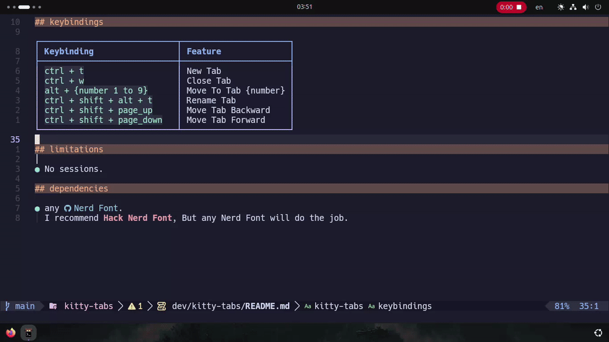

# kitty-tabs

<!--toc:start-->

- [kitty-tabs](#kitty-tabs)
  - [showcase](#showcase)
  - [keybindings](#keybindings)
  - [limitations](#limitations)
  - [dependencies](#dependencies)
  <!--toc:end-->

_Kitty_ terminal config.  
Replace _tmux's_ tab functionality with _kitty_'s native tabs with same keybindings as _Firefox_.  
Code for tabs is at [tabs.conf](./tabs.conf).

Config uses [Catppuccin](https://catppuccin.com) theme hex colors by default
both in [theme.conf](./theme.conf) and [tabs.conf](./tabs.conf).  
Hex colors in [tabs.conf](./tabs.conf) look like this: `_FFFFFF`,
instead of like this `#FFFFFF`

## showcase

## keybindings

| Keybinding               | Feature              |
| ------------------------ | -------------------- |
| `ctrl + t`               | New Tab              |
| `ctrl + w`               | Close Tab            |
| `alt + {number 1 to 9}`  | Move To Tab {number} |
| `ctrl + shift + alt + t` | Rename Tab           |

## limitations

- No sessions.

## dependencies

- any [Nerd Font](https://github.com/ryanoasis/nerd-fonts).
  I recommend **Hack Nerd Font**, But any Nerd Font will do the job.
